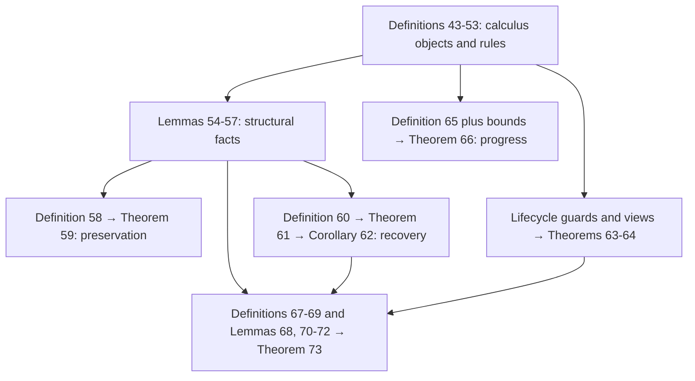

# DeepSeek Harness: Formal Reference

Last updated: 2026-08-24  
Primary source: Shi, Zhang, and Cui, *A Programming Paradigm for Spatiotemporal Composability*, especially Sections 3-5.

Navigation: [Project Guide](./DeepSeek-Harness-00-Project-Guide.md) · [Research Ledger](./DeepSeek-Harness-02-Research-Ledger.md)

## 1. Reading conventions

- Function composition is right-to-left: `(f ∘ g)(x) = f(g(x))`.
- An "inverse" in the paper is generally only a **left inverse at the state where the effect ran**. It is not necessarily a two-sided inverse or even a left inverse at every state.
- `pr₁`, `pr₂`, and `pr₃` denote product projections.
- `id_Γ` denotes the identity function on `Γ`.
- Equality is used initially for clarity. From Definition 33 onward, the significant results are reread modulo observational equivalence `≃`.
- A statement about the calculus is conditional on the calculus's hypotheses. It is not automatically a statement about arbitrary TypeScript code.

## 2. Core notation

| Symbol | Type or definition | Meaning |
|---|---|---|
| `Γ` | `Type` or abstract state space | The context/state on which effects act |
| `γ, δ, ε` | elements of `Γ` | Context states |
| `f, g, s, t` | usually `Γ → Γ` | State transformations; `g,s,t` often serve as inverses |
| `𝔗_Γ` | `(Γ → Γ) × (Γ → Γ)` with twisted multiplication | Forward/inverse transformation pairs |
| `∂Γ` | `Γ × (Γ → Γ)` | Effect context: current state plus accumulated recovery function |
| `φ` | `Γ → Γ` | Accumulator of inverses; `φ(γ)` is the recovery target |
| `track_Γ` | `𝔗_Γ → ∂Γ → ∂Γ` | Applies a forward map and appends its inverse to the accumulator |
| `recover_Γ` | `∂Γ → ∂Γ` | Applies the accumulator and resets it to identity |
| `𝔈_Γ` | `Γ → Γ × (Γ → Γ)` | Effect functions returning their state-specific inverse |
| `𝔈*_Γ` | witnessed subset/refinement of `𝔈_Γ` | Effects whose returned inverse restores the input state |
| `⋄` | `𝔈_Γ × 𝔈_Γ → 𝔈_Γ` | Sequential effect composition with reverse-order inverse composition |
| `η_Γ` | `γ ↦ (γ, id_Γ)` | Unit effect |
| `effect_Γ` | `𝔈_Γ → 𝔈_{∂Γ}` | Lifts an effect to the tracked effect context and returns a candidate disposer; crossing foreign effects needs independence |
| `𝔐(e)` | submonoid of `Γ → Γ` | All transformations generated by `e`'s forward map and every inverse it may return |
| `K` | key type | Names of dependencies/coeffects |
| `𝒱 : K → Type` | type family | Value type associated with each key |
| `𝒜_k` | set of operations on `𝒱_k` | Interface through which a component can observe or change a value at key `k` |
| `a_Σ` | lifted coeffect operation on `Σ` | Runs a key-local operation against the whole dependency table |
| `Σ` | `(k : K) ⇀ 𝒱_k` | Finite dependent partial map: the basic coeffect context |
| `σ` | element of `Σ` | A coeffect/dependency table |
| `d` | subset of `K` or richer metadata map | A component's coeffect specification |
| `𝔇_Σ` | `Set(K)` in the basic model | Space of coeffect specifications |
| `σ ⊧ d` | `∀ k ∈ d, k ∈ dom(σ)` | Satisfaction of all declared dependencies |
| `notify_d(σ,σ')` | activating/deactivating/neutral | Classification of a dependency-state transition |
| `Σ_iso` | realm table plus value table | Coeffect context supporting isolated bindings |
| `Σ_inter` | metadata table plus provider table | Coeffect context supporting interception |
| `Γ∞` | `μΓ. Γ × (Γ → Γ) × Σ` in the paper | Intended self-similar context combining nested accumulators and coeffects |
| `≃_k` | equivalence on `𝒱_k` | Observational equivalence for a coeffect value |
| `≃` | induced relation on contexts | Same bound keys with pointwise observationally equivalent values |
| `ℭ_Γ` | `𝔇_Γ × 𝔓_Γ × 𝔈*_Γ` | Component type: requirements, provisions, and witnessed effect |
| `𝔓_Γ` | `Set(K)` | Declared set of keys a component may provide |
| `n ∈ 𝔑` | fiber name | Identity of one component instantiation |
| `𝔉_Γ` | set of fibers over `Γ` | Fiber carrier used by a registry |
| `F_γ` | `𝔑 ⇀ 𝔉_Γ` | Registry of fibers carried by a state |
| `Θ_Γ` | lifecycle-state type | Base or extended lifecycle states carried by a fiber |
| `θ_n` | lifecycle state | Inactive, reloading, active, unloading, or failed state of fiber `n` |
| `ω_n` | `d_n → 𝔑` | Committed provider view of a fiber |
| `τ_n` | Boolean | Retirement flag |
| `π_n` | fiber name or root | Parent fiber |
| `target_n(γ)` | provider view or `⊥` | Providers currently resolving `n`'s dependencies, or unsatisfied |
| `quiet(γ)` | predicate | Every fiber's lifecycle state agrees with its current target |
| `𝔈^iter_Γ` | iterator-shaped effect type | One effect stage yielding state, inverse, and optional continuation |
| `reach(i)` | continuation closure of iterator `i` | All iterators reachable by repeatedly following continuations |
| `≈` | separate relation on calculus states | Forgets designated registry control artifacts; it neither refines nor is refined by `≃` |
| `γ ⇒ δ` | orchestration relation | External insert, retire, or remove action chosen by the orchestrator |
| `γ ⟶ δ` | lifecycle relation | Internal lifecycle step taken whenever a rule's premises hold |
| `⟶*` | reflexive-transitive lifecycle closure | Zero or more lifecycle steps |
| `≺` | `n ≺ m :⇔ p_n ∩ d_m ≠ ∅` | Provider-before-consumer precedence relation |
| `⊲` | `m ⊲ n :⇔ m ≺ n ∨ π_n=m` | Combined provider/parent support relation |
| `A` | recursively defined support set | Supported fibers; equals active fibers only under Lemma 70's hypotheses |

Notation is overloaded in the paper. In Section 3.1, `f` and `g` often mean a forward map and inverse; elsewhere they may denote whole effect functions. The context relation `≃` is built from per-key relations `≃_k`. The type of keys is italic `K`, whereas the bound on iterator length in Theorem 66 is a separate capital constant `𝐾`. From Definition 52 onward, a component's `e` is read at the richer iterator type rather than only `𝔈*_Γ`.

## 3. Revertible effects: definitions

### Definition 1: twisted composition

For pairs of transformations,

`(f₁,g₁) ∘ (f₂,g₂) := (f₁ ∘ f₂, g₂ ∘ g₁)`.

The forward functions execute in program order; the inverses compose in reverse order. This makes `𝔗_Γ` the product of the transformation monoid with its opposite.

### Definition 2: effect context

`∂Γ := Γ × (Γ → Γ)`.

A value `(γ,φ)` contains the current state and an accumulator that should recover the original state. The initial tracked state is `(γ₀,id_Γ)`.

### Definition 3: tracking

`track_Γ(f,g)(γ,φ) := (f(γ), φ ∘ g)`.

The inverse is appended on the right of `φ`, so when `φ ∘ g` is eventually applied to the current state, the newest inverse `g` runs first.

### Definition 6: recovery

`recover_Γ(γ,φ) := (φ(γ), id_Γ)`.

The key invariant is not that `φ` literally remains unchanged. It is that `φ(γ)` remains the recovery target.

### Definition 8: effect and witnessed effect functions

An effect function is

`𝔈_Γ := Γ → Γ × (Γ → Γ)`.

If `e(γ) = (δ,g)`, the effect computes the new state `δ` and returns the inverse `g` chosen for this particular application.

The witnessed refinement can be written more transparently as

`𝔈*_Γ := { e : 𝔈_Γ | ∀ γ, let (δ,g) := e(γ); g(δ) = γ }`.

The witness constrains `g` only at the actual successor `δ`. It need not satisfy `g ∘ f = id_Γ` globally, where `f = pr₁ ∘ e`.

**Motivation.** A cleanup operation often depends on the old state. For example, setting a cell to `v_new` must remember its previous value `v_old` and return an inverse that restores `v_old`. One fixed inverse known before seeing the input state is too restrictive.

### Definition 9: effect composition

For `f,g ∈ 𝔈_Γ`, with the right operand executed first,

```text
(f ⋄ g)(γ) =
  let (δ,s) := g(γ)
  let (ε,t) := f(δ)
  (ε, s ∘ t).
```

Thus `t` undoes the later effect `f`, after which `s` undoes the earlier effect `g`.

### Definition 12: lifting an effect

If `e(γ) = (δ,g)`, then

`effect_Γ(e)(γ,φ) := ((δ, φ ∘ g), track_Γ(g, pr₁ ∘ e))`.

This does two jobs simultaneously:

1. it performs `e` on the underlying state and records `g` in the accumulator;
2. it returns an inverse one level up, structurally allowing this particular tracked effect to be disposed while other tracked effects remain.

The returned higher-level inverse is `track_Γ(g,f)`, with `f = pr₁ ∘ e`: it applies `g` to undo the underlying state change and records `f` as the candidate operation that undoes that undo at the actual application state. No global `f ∘ g = id` law is claimed. Correctness for immediate or LIFO disposal is covered by Theorems 15-16. Running this disposer across later foreign effects additionally requires independence as in Definition 19 and Theorem 20.

### Definition 17: transformation monoid

`𝔐(e) := ⟨ {pr₁ ∘ e} ∪ {pr₂(e(γ)) | γ ∈ Γ} ⟩`.

It includes the forward map, every state-dependent inverse the effect can return, and all finite composites of those generators.

### Definition 19: effect independence

Effects `e₁,e₂` are independent when:

1. every transformation in `𝔐(e₁)` commutes with every transformation in `𝔐(e₂)`;
2. applying any transformation of one effect does not change the returned inverse of the other effect, symmetrically:

   `pr₂(e₁(g(γ))) = pr₂(e₁(γ))` for all `g ∈ 𝔐(e₂)`, and conversely.

Clause 2 is essential for state-dependent inverses. Before Definition 37 this is literal equality of returned functions. After passing to observational equivalence, it is pointwise agreement modulo `≃`, not necessarily identity of closure representations. For iterators, Definition 60 similarly requires agreement of the yielded inverse and continuation. Commutation of already-selected transformations alone does not supply this stability.

## 4. Revertible effects: theorem dependency map

| Result | Main statement | Depends on | Feeds into / significance |
|---|---|---|---|
| Theorem 4 | `pr₁ ∘ track_Γ(f,g) = f ∘ pr₁` | Definitions 2-3 | Projection half of Theorem 14; tracking preserves visible forward behavior |
| Theorem 5 | `track_Γ` is a monoid homomorphism | Definitions 1 and 3 | Theorem 13; tracking a composite equals composing tracked effects |
| Theorem 7 | If `g(f(γ))=γ`, then recovery after tracking equals recovery before tracking | Definitions 3 and 6 | Soundness invariant and sequence recovery |
| Theorem 10 | `(𝔈_Γ,⋄,η_Γ)` is a monoid; uniform pairs embed homomorphically | Definitions 1, 8-9 | Theorem 11 and the Kleisli/Writer reading |
| Theorem 11 | `𝔈*_Γ` is a submonoid; global left inverses induce witnessed effects | Definitions 8-9; Theorem 10 | Correct local undo witnesses compose |
| Theorem 13 | `effect_Γ(f) ⋄ effect_Γ(g) = effect_Γ(f ⋄ g)` | Definitions 9 and 12; Theorem 5 | Closure of lifted tracking under effect composition |
| Theorem 14 | Forward maps and yielded inverses commute with projection `pr₁` | Definitions 3 and 12; Theorem 4 | Relates the two context levels |
| Theorem 15 | The lifted inverse recovers the underlying state and recovery target, but not generally the accumulator function | Definitions 8 and 12; Theorem 14's setup | Theorem 16 and the exact limit of higher-level witnessing |
| Theorem 16 | Reverse-order reversion restores every preceding state and preserves soundness | Theorems 7 and 15 | LIFO rollback without independence |
| Lemma 18 | Generator commutation extends to generated monoids; `⋄` adds no new generator kind | Definitions 9 and 17 | Definitions 19 and Theorem 20; atomic independence checks |
| Theorem 20 | Under pairwise independence, removing one effect after later effects yields the state with that effect omitted | Definitions 8, 17, 19; Lemma 18 | Corollary 21; selective removal across foreign effects |
| Corollary 21 | Pairwise-independent inverses may run in any permutation and recover the initial state | Theorem 20 | Interleaved component lifetimes |

### Theorem 15 in exact operational terms

Let `e ∈ 𝔈*_Γ`, `f := pr₁ ∘ e`, `e(γ)=(δ,g)`, and let `effect_Γ(e)(γ,φ)=(Δ,g')`. Then

`g'(Δ) = (γ, φ ∘ g ∘ f)`.

Consequences:

- the state component is exactly `γ`;
- the accumulator need not return to `φ` as a function;
- for the particular returned inverse `g_γ`, exact accumulator restoration for every `φ` at that input is equivalent to `g_γ ∘ f = id_Γ`; membership `effect_Γ(e) ∈ 𝔈*_{∂Γ}` requires this condition for every input `γ` (the returned `g_γ` may vary with `γ`);
- nevertheless `(φ ∘ g ∘ f)(γ)=φ(γ)`, so the soundness invariant is preserved at the actual state.

This is why the construction does not prove an infinite hierarchy of ever-stronger global inverses. It maintains the weaker invariant actually needed for recovery.

### Theorem 16 and LIFO

LIFO abbreviates **last in, first out**. If effects are applied as `e₁,...,eₙ`, their inverses run as `gₙ,...,g₁`. Each `gᵢ` then receives exactly the state produced by `eᵢ`, so its local witness applies. Independence is needed only when an inverse must cross effects belonging to other components or be run in another order.

## 5. Monad/Kleisli interpretation

For fixed `Γ`, let the log monoid be `End(Γ) = Γ → Γ` with multiplication `s · t := s ∘ t` in the order used for accumulated inverses, and define the Writer-like endofunctor

`T_Γ(X) := X × End(Γ)`.

Then

`𝔈_Γ = Γ → T_Γ(Γ)`

is the type of Kleisli endomorphisms of `Γ`, Definition 9 is Kleisli composition, and `η_Γ` is the Kleisli identity. Theorem 10 is therefore the monoid law for Kleisli endomorphisms.

The correspondence is genuine but not complete:

- `𝔈*_Γ` adds a semantic correctness predicate connecting the log entry to the state transition. This is not a monad law.
- Definition 12's forward behavior resembles Writer/Kleisli extension into an already accumulated log.
- The full `effect_Γ` additionally returns a reversible disposer on `∂Γ`; this extra reversible structure is not supplied by the ordinary Writer monad.
- Theorem 13 is a composition-homomorphism result for this lift.
- Theorem 14 is projection compatibility. Calling it ordinary naturality would require a broader functorial setup that the paper does not define.

The paper's later comparison with monadic effect systems is also architectural: monadic systems require computations to be written inside an effect type, while Cordis overlays tracking on ordinary host-language operations mediated by a context.

## 6. Why the lift is needed

Without Definition 12, one can accumulate all inverses and recover everything at once, but cannot uniformly express:

- constructing a disposer for one effect while retaining the structural record of others;
- nesting a child component's entire lifetime as one effect of its parent;
- composing effect registration itself with other effectful operations;
- returning a first-class disposer from the same primitive that applies the effect.

Operationally, Section 5 describes Cordis's `ctx.effect(callback)` as performing this lift: it runs a callback, accumulates the inverses it yields, returns an idempotent disposer, and prepends that disposer to the parent context's accumulator. Semantic correctness across later foreign effects still depends on independence.

## 7. The `∂`-tower and `Γ∞`: formalization caution

The paper writes `∂²Γ`, `∂³Γ`, and then introduces

`Γ∞ := μΓ. Γ × (Γ → Γ) × Σ`

as a self-similar context unifying arbitrary nesting with the coeffect context.

**[DISCUSSION/INFERENCE] Literal Lean issue.** This is not an ordinary inductive type declaration:

- `F(X)=X × (X → X) × Σ` is mixed-variance rather than an ordinary covariant endofunctor whose `μF` would be a standard initial algebra;
- `Γ` occurs negatively in `Γ → Γ`, violating Lean's strict-positivity requirement;
- in ordinary `Type`/`Set`, when `|X| ≥ 2` and `Σ` is inhabited, a solution to `X ≅ X × (X → X) × Σ` faces a cardinality obstruction, since `|X → X| ≥ 2^{|X|} > |X|`;
- treating `μ` as an ordinary least fixed point is therefore mathematically nontrivial, not mere notation that Lean will accept.

Possible formal representations, not yet chosen, include:

1. a finite, stratified tower `Γ₀, Γ₁, ...` with the required maximum depth fixed;
2. a syntax of context transformations rather than the full function space `Γ → Γ`;
3. an explicit tree of scopes, each carrying transformations of a fixed base state;
4. guarded/domain-theoretic recursion in a category where the recursive equation is meaningful;
5. an implementation-level universal/dynamic carrier plus an invariant, rather than a literal type isomorphism.

Any mechanization should first decide which interpretation matches the proofs. It should not silently encode Definition 32 as a Lean inductive type.

## 8. Reactive coeffects and unification

### Definitions 22-26

- `Σ := (k : K) ⇀ 𝒱_k` is a finite typed dependency table.
- `get(k)` reads a present binding.
- `set(k,v)` installs an absent binding and returns deletion as its inverse; it is a witnessed effect on `Σ`.
- A coeffect at key `k` consists of `(𝒱_k, ≃_k, 𝒜_k)`: a value type, an observational equivalence, and operations exposed by the value.
- `d ∈ 𝔇_Σ := Set(K)` declares required keys.
- `σ ⊧ d` means all declared keys are present.
- `notify_d(σ,σ')` is activating if satisfaction changes false-to-true, deactivating for true-to-false, and neutral otherwise.

### Definitions 27-31

- **In-place realization** mutates a context and returns a nontrivial inverse.
- **Derived realization** constructs a child context and uses identity as the inverse; recovery discards the child.
- Isolation changes which realm a key resolves through.
- Interception changes metadata governing how a binding is used without changing which provider is bound.

### Definitions 33-42

- Context equivalence `≃` is assembled pointwise from coeffect equivalences and compares only the coeffect projection. It forgets every unkeyed part of state. Calling this observationally adequate therefore depends on a faithful system boundary and sufficiently discriminating per-key equivalences; an excessively coarse choice can weaken or trivialize recovery claims.
- Definition 37 strengthens witnessed effects modulo `≃`: effects and returned inverses must respect the relation, and the inverse recovers the input up to `≃`.
- Lemma 38 transports the Section 3.1 recovery results from equality to observational equivalence.
- Operations at distinct keys are independent (Theorem 40).
- Coeffect-mediated computations built from independent operations are independent (Theorem 42), provided every shared key is commutative.

The important design decomposition is:

- commuting interactions live as effects and may be reordered;
- order-sensitive interactions are exposed as coeffects, so dependency/lifecycle ordering carries the constraint;
- within one component, LIFO imposes an order even without commutativity.

Two explicit limits remain: every shared location must actually be mediated by a key, and commutativity of a key's interface is an obligation on its provider.

## 9. Components and global metatheory

### Component and fiber

Definition 43 gives

`ℭ_Γ := 𝔇_Γ × 𝔓_Γ × 𝔈*_Γ`.

A component declares what it requires (`d`), what keys it may provide (`p`), and the witnessed effect/iterator it runs (`e`). A fiber is one runtime instantiation, carrying its parent, own coeffect table, retirement flag, lifecycle state, accumulator, and committed provider view.

### Main global results

The global dependency spine is:



| Result | Informal guarantee | Principal hypotheses or scope |
|---|---|---|
| Theorem 59, Preservation | One operational step preserves registry well-formedness. | A well-formed pre-state inside the full guarded/confined calculus and its registration discipline; induction gives preservation along a trace. |
| Theorem 61, Recovery exactness | Within an open episode, applying one fiber's accumulator preserves the interleaved foreign state transformations. | Pairwise-independent steps and the episode/index hypotheses; conclusion is modulo `≈`, not an identification of `≈` with `≃`. Reading the result as "the run where `n` never began" additionally requires that no fiber registered by `n` takes a step during the interval. |
| Corollary 62, Terminal recovery | A closed or removed fiber leaves no contribution behind. | Same independence envelope as Theorem 61. |
| Theorem 63, Ordering | Consumers activate after providers and finish teardown before providers withdraw the bindings they used. | Guarded unloading and well-formed lifecycle discipline. |
| Theorem 64, Resolution coherence | Completed iterations use one committed resolution; an already in-flight iteration may land after the target changes, after which `L-Divert` rolls it back. | Inertial lifecycle and iteration-boundary checks; the rollback equation appeals to Corollary 62 and therefore inherits pairwise independence, although the displayed theorem statement does not restate it. |
| Theorem 66, Progress | No lifecycle deadlock; every maximal lifecycle-only run terminates quiescently. | Every step is a lifecycle rule, precedence `≺` is acyclic, iterator length is bounded, and the set of fiber names in scope is finite. Orchestration changes are outside the run being bounded. |
| Theorem 73, Confluence | Quiescent states reached with the same **ordered orchestration-step sequence** have a canonical, schedule-independent form modulo `≃`, `≈`, and fresh-name renaming. | Pairwise independence, total provision, no failed fiber, and quiescence; acyclicity/well-founded support is inherited through Definition 67 and Lemma 68 though omitted from the displayed theorem premise. Theorem 73 does not itself prove quiescence. |

Theorem 73 concerns final modeled state, not the sequence of external emissions produced on the way.

## 10. Paper-to-Cordis correspondence **[PAPER, Section 5]**

| Formal construct | Runtime counterpart described in Section 5 |
|---|---|
| `Γ∞` | `ctx`, the first-class context/tree |
| `𝔈_Γ`, `𝔈^iter_Γ` | callback returning or yielding inverse closures |
| `effect_Γ(e)` | `ctx.effect(callback)` |
| `Σ`, isolation, interception | internal store, isolation-realm table, interception table |
| `get`, `set` | `ctx.get`, `ctx.set` |
| component/fiber | component plus the fiber created by `ctx.use` |
| `d` | `fiber.inject` |
| `e` | `fiber.apply` |
| accumulator/recover | `fiber.dispose` |
| committed view `ω` | `fiber.committed` |
| target view | `fiber.target` recomputed by refresh |
| transition inertia | `fiber.inertia` |
| lifecycle rules | execute/reload/unload/refresh state machine |

The paper explicitly states in Section 5.1.1 that `ctx.effect` **does not check the witness in `𝔈*_Γ`**. It trusts the callback author to return a correct inverse. Section 5.1.4 describes TypeScript module augmentation and runtime proxy mediation for dependency access, but these mechanisms do not prove functional refinement of plugin bodies. These are paper-described implementation facts until independently confirmed against a pinned Cordis repository revision.
