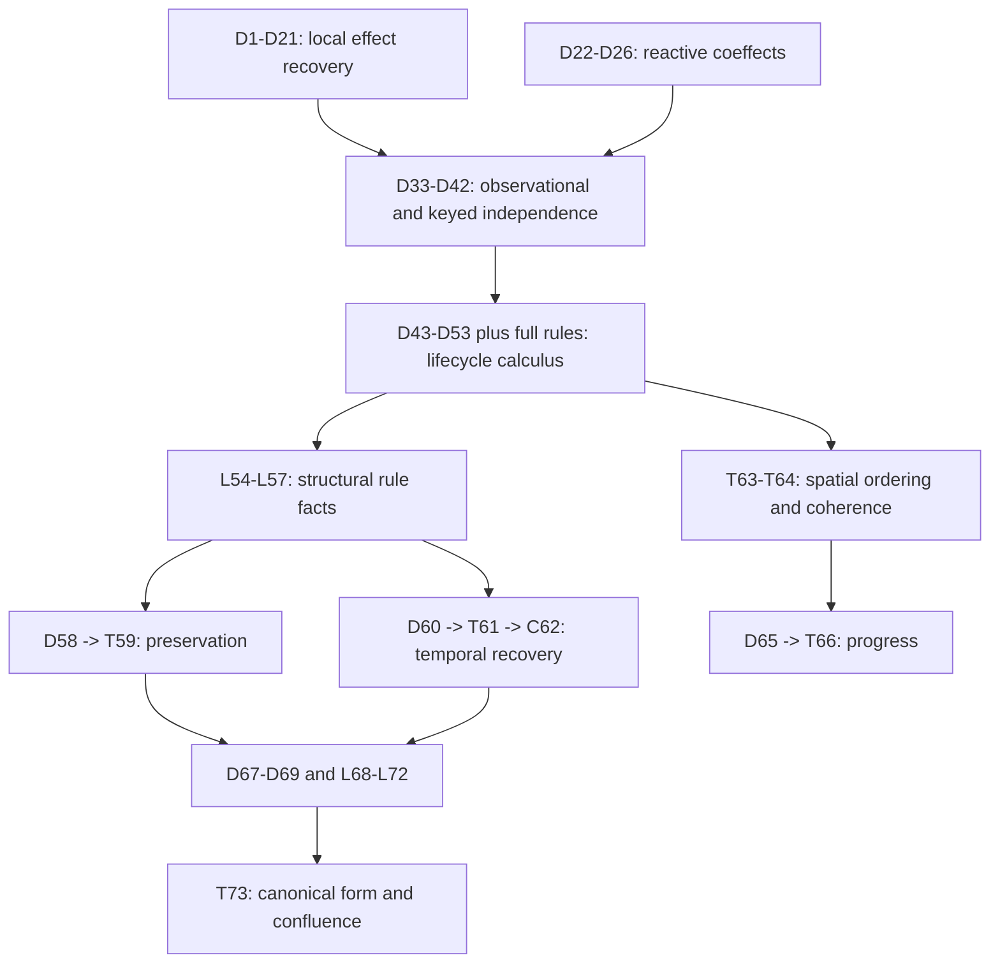

# DeepSeek Harness: Definition and Result Dependency Graph

Version: **1.0-frozen**  
Frozen: 2026-08-25  
Source: Shi, Zhang, and Cui, *A Programming Paradigm for Spatiotemporal Composability*  
Source SHA-256: `4d48478dc0b6222d9f74d7db10ee776449b1209eb112632336544d32a49db97f`

This is the fixed dependency baseline for the paper's 74 consecutively numbered formal items. It records dependency structure only: no mechanization priority, validity judgment, repair, difficulty, ownership, or scope decision is encoded here. The companion JSON file is the machine-readable source for graph queries and later blueprint generation.

## Dependency policy

- Edge direction is **prerequisite -> dependent**.
- Only **direct** dependencies are recorded; transitive closure is deliberately omitted.
- **Statement dependencies** are needed to form, type, or state the item as presented.
- **Proof/justification dependencies** are directly cited or substantively used in the printed proof or the immediate justification following a definition.
- Evidence tags are **E** (explicit numbered/formal-block citation), **I** (implicit but substantive use), and **Fwd** (forward dependency on a later-numbered item).
- Lemma 38 has one exceptional **scope dependency** on the complete Section 3.1 package because its statement transports every Section 3.1 state equality. The JSON expands this into individual scope edges.
- Mere motivation, later applications, implementation correspondence, and a node's transitive prerequisites are not edges.

## Inventory and integrity checks

| Item class | Count |
|---|---:|
| Definitions | 43 |
| Theorems | 18 |
| Lemmas | 11 |
| Corollaries | 2 |
| **Total numbered items** | **74** |
| Auxiliary unnumbered formal blocks | 8 |
| Direct dependency-edge records | 540 |

The numbered inventory is exactly 1 through 74, with no gap or duplicate.
The graph is intentionally not forced into a DAG: the paper's forward-reference cycles around D49/R.iter/R.fail and D67/L68 are preserved.

## Auxiliary unnumbered nodes

These nodes prevent real theorem dependencies on satisfaction or operational rules from disappearing merely because the paper did not assign them a Definition number.

| ID | Section | Formal block | Direct construction dependencies |
|---|---|---|---|
| SAT | 3.2.2 | Satisfaction predicate (Equation 24) | D22 (I), D25 (Fwd) |
| R.base | 4.2 | Base operational rules | D43 (I), D44 (I), D45 (I), D46 (I), D8 (I) |
| R.withdraw | 4.3.1 | Withdrawal rules | D46 (I), D49 (I), D50 (I) |
| R.iter | 4.3.2 | Iteration lifecycle rules | D44 (I), D46 (I), D49 (I), D51 (I), D52 (I) |
| A.async | 4.3.3 | Asynchronous inertia restriction | D49 (I), R.iter (I) |
| R.fail | 4.3.4 | Failing iterator refinement and L-Raise | D49 (I), D51 (I), D52 (I), R.iter (I) |
| R.full | 4.3-4.4 | Full ten-rule calculus | R.base (I), R.withdraw (I), R.iter (I), A.async (I), R.fail (I), D47 (I), D48 (I) |
| Table1 | 4.4 | Rule decomposition into state maps and control edits | D53 (I), R.full (I) |

## Numbered dependency registry

### Section 3.1 - Revertible effects

| Node | Section | Canonical title | Statement dependencies | Proof / immediate-justification dependencies |
|---|---|---|---|---|
| D1 | 3.1.1 | Definition 1 - Twisted composition of transformation pairs | - | - |
| D2 | 3.1.1 | Definition 2 - Effect context | - | - |
| D3 | 3.1.1 | Definition 3 - Tracking transformation | D2 (E) | - |
| T4 | 3.1.1 | Theorem 4 - Projection of tracking | D2 (E), D3 (E) | D2 (I), D3 (I) |
| T5 | 3.1.1 | Theorem 5 - Tracking is a monoid homomorphism | D1 (E), D2 (E), D3 (E) | D1 (I), D2 (I), D3 (I) |
| D6 | 3.1.1 | Definition 6 - Recovery transformation | D2 (E) | - |
| T7 | 3.1.1 | Theorem 7 - One-step recovery invariance | D2 (E), D3 (E), D6 (E) | D3 (I), D6 (I) |
| D8 | 3.1.2 | Definition 8 - Effect functions and witnessed effect functions | D2 (I) | - |
| D9 | 3.1.2 | Definition 9 - Effect composition | D8 (E), D2 (E) | - |
| T10 | 3.1.2 | Theorem 10 - Monoid of effects and embedding of uniform pairs | D1 (E), D8 (E), D9 (E) | D1 (I), D8 (I), D9 (I) |
| T11 | 3.1.2 | Theorem 11 - Witnessing survives composition | D8 (E), T10 (E) | D8 (I), D9 (I), T10 (I) |
| D12 | 3.1.2 | Definition 12 - Lift of an effect to the effect context | D8 (E), D2 (E), D3 (E) | - |
| T13 | 3.1.2 | Theorem 13 - The effect lift preserves composition | D8 (E), D9 (E), D12 (E) | D12 (E), T5 (E), D9 (I) |
| T14 | 3.1.2 | Theorem 14 - Projection compatibility across effect levels | D8 (E), D12 (E), D2 (E) | D12 (E), T4 (E) |
| T15 | 3.1.2 | Theorem 15 - Exact behavior of the lifted inverse | D8 (E), D12 (E), D2 (E) | D12 (E), D3 (I), D8 (I) |
| T16 | 3.1.2 | Theorem 16 - LIFO recovery for witnessed effects | D8 (E), D2 (I), D12 (I) | T7 (E), T15 (E), D8 (I), D12 (I) |
| D17 | 3.1.3 | Definition 17 - Transformation monoid of an effect | D8 (E) | - |
| L18 | 3.1.3 | Lemma 18 - Generator commutation and composition closure | D17 (E), D9 (E), D8 (I) | D9 (E), D17 (I), D8 (I) |
| D19 | 3.1.3 | Definition 19 - Independence of effect functions | D8 (E), D17 (E) | - |
| T20 | 3.1.3 | Theorem 20 - Selective removal across later independent effects | D8 (E), D19 (E) | D19 (E), D8 (E), D17 (I) |
| C21 | 3.1.3 | Corollary 21 - Arbitrary-order recovery | D8 (E), D19 (E), T20 (E) | T20 (E), D19 (I) |

### Sections 3.2-3.3 - Reactive coeffects and the context paradigm

| Node | Section | Canonical title | Statement dependencies | Proof / immediate-justification dependencies |
|---|---|---|---|---|
| D22 | 3.2.1 | Definition 22 - Finite dependent partial-map coeffect context | - | - |
| D23 | 3.2.1 | Definition 23 - Basic get and revertible set | D22 (I) | - |
| D24 | 3.2.1 | Definition 24 - Coeffect interface at a key and its context lift | D22 (E), D8 (E) | - |
| D25 | 3.2.2 | Definition 25 - Coeffect specifications | D22 (I) | - |
| D26 | 3.2.2 | Definition 26 - Reactive transition classifier notify | D22 (I), D25 (I), SAT (E) | - |
| D27 | 3.2.3 | Definition 27 - In-place and derived realizations | D8 (I) | - |
| D28 | 3.2.3 | Definition 28 - Isolation context | D22 (I) | - |
| D29 | 3.2.3 | Definition 29 - Isolation-aware get, set, and isolate | D28 (I), D27 (I), D23 (E) | - |
| D30 | 3.2.3 | Definition 30 - Interception context and specification | D22 (I), D25 (I) | - |
| D31 | 3.2.3 | Definition 31 - Interception-aware get, set, and intercept | D30 (I), D27 (I), D23 (E) | - |
| D32 | 3.3.1 | Definition 32 - Recursive unified context | D2 (E), D22 (I) | - |
| D33 | 3.3.2 | Definition 33 - Observational relation on coeffect contexts and states | D22 (I), D24 (E), D32 (E) | - |
| D34 | 3.3.2 | Definition 34 - Tests and operation-induced indistinguishability | D24 (E), D17 (E) | - |
| L35 | 3.3.2 | Lemma 35 - Indistinguishability is the coarsest operation-respecting relation | D34 (I), D24 (E) | D34 (I), D24 (I) |
| D36 | 3.3.2 | Definition 36 - Equivalence-respecting and pointwise-related maps | D33 (I), D2 (I) | - |
| D37 | 3.3.2 | Definition 37 - Witnessed effects modulo observational equivalence | D8 (E), D33 (I), D36 (I) | - |
| L38 | 3.3.2 | Lemma 38 - Transport of Section 3.1 equalities to observational equivalence | D37 (E); Section 3.1 package (Scope) | D37 (E), T7 (E), D36 (I) |
| D39 | 3.3.2 | Definition 39 - Operation independence and commutative keys | D24 (I), D17 (I), D19 (E), D34 (E), L38 (E) | - |
| T40 | 3.3.2 | Theorem 40 - Operations at distinct keys are independent | D24 (I), D39 (I) | D24 (E), L18 (E), D22 (I), D17 (I), D39 (I) |
| D41 | 3.3.2 | Definition 41 - Coeffect-mediated effect functions | D8 (I), D9 (I), T10 (I), D24 (I) | - |
| T42 | 3.3.2 | Theorem 42 - Independence of coeffect-mediated effect functions | D41 (I), D39 (E), D19 (E), L38 (I) | D41 (E), L18 (E), D19 (E), T40 (E), D39 (E), D17 (I), D9 (I), T10 (I), D24 (I) |

### Section 4 - Calculus of dynamic composition

| Node | Section | Canonical title | Statement dependencies | Proof / immediate-justification dependencies |
|---|---|---|---|---|
| D43 | 4.1 | Definition 43 - Components | D32 (E), D25 (E), D8 (E), D22 (I), D23 (I) | - |
| D44 | 4.1 | Definition 44 - Fibers and the base lifecycle state | D43 (E), D22 (E), D2 (I), D8 (I) | - |
| D45 | 4.1 | Definition 45 - Registry, derived coeffect context, and providers | D43 (E), D44 (E), SAT (E), D22 (I), D25 (I) | - |
| D46 | 4.2 | Definition 46 - Target view and base quiescence | D44 (I), D45 (I), SAT (I) | - |
| D47 | 4.2 | Definition 47 - Nested registration primitive | D43 (E), R.base (E), D44 (I), D45 (I), D46 (I), D8 (I), D51 (Fwd) | - |
| D48 | 4.2 | Definition 48 - Confinement | D47 (E), D43 (I), D44 (I), D45 (I), D8 (I), D51 (Fwd) | - |
| D49 | 4.3 | Definition 49 - Extended lifecycle, installed/failed predicates, and quiescence | D46 (E), D51 (Fwd), R.fail (Fwd), D44 (I), D45 (I) | - |
| D50 | 4.3.1 | Definition 50 - Relied-upon relation | D44 (I), D45 (I), D49 (I) | - |
| D51 | 4.3.2 | Definition 51 - Witnessed effect iterators | D33 (E), D37 (E), D8 (I), D36 (I) | - |
| D52 | 4.3.2 | Definition 52 - Effect-iterator transformation | D51 (E), D2 (I), D3 (I), D12 (I) | - |
| D53 | 4.4 | Definition 53 - Indexed traces, episodes, step factorization, and state relations | D45 (E), D46 (E), D47 (E), D49 (E), D50 (E), D51 (E), D33 (E), D36 (E), D37 (E), L38 (E), D44 (I), R.full (I) | - |
| L54 | 4.4 | Lemma 54 - Structural write facts | D48 (E), Table1 (E), D44 (I), D47 (I), D49 (I), D53 (I) | D47 (E), D48 (E), D49 (I), D53 (E), Table1 (E), R.full (I) |
| L55 | 4.4 | Lemma 55 - Observational-equivalence invariance | D53 (E), R.full (E), D43 (I), D45 (I), D46 (I), D49 (I), D50 (I), D51 (I), D33 (I), D36 (I), D37 (I) | D45 (E), D46 (I), D49 (I), D50 (I), D51 (E), D53 (E), D33 (E), D36 (I), D37 (I), R.full (I) |
| L56 | 4.4 | Lemma 56 - Equivariance under fiber-name renaming | D58 (Fwd), D44 (I), D45 (I), D53 (I), R.full (I) | D45 (I), D46 (I), D47 (E), D48 (E), D50 (I), D58 (E), R.full (I) |
| L57 | 4.4 | Lemma 57 - Vestigial entries | D53 (E), D44 (I), D45 (I), D46 (I), D49 (I), D50 (I), R.full (I) | D45 (I), D46 (I), D48 (E), D49 (I), D50 (I), D53 (I), L54 (E), Table1 (I), R.full (I) |
| D58 | 4.4.1 | Definition 58 - Well-formed registry | D45 (E), D43 (I), D44 (I), D49 (I) | - |
| T59 | 4.4.1 | Theorem 59 - Preservation of registry well-formedness | D58 (E), D53 (I), R.full (I) | D43 (E), D44 (I), D45 (I), D46 (I), D49 (I), D50 (I), D53 (I), L54 (E), Table1 (E), R.full (I) |
| D60 | 4.4.2 | Definition 60 - Iterator reach, length, transformation monoid, and independence | D17 (E), D19 (E), D36 (E), D47 (E), D51 (E), D44 (I), D53 (I), R.fail (I) | - |
| T61 | 4.4.2 | Theorem 61 - Recovery exactness | D53 (E), D60 (E), D44 (I), D49 (I) | D47 (E), D48 (E), D49 (I), D51 (E), D53 (E), L54 (E), L57 (E), D60 (I), T7 (E), D36 (I), D37 (I), L38 (I), Table1 (E), R.full (I) |
| C62 | 4.4.2 | Corollary 62 - Terminal recovery | T61 (E), D49 (I), D53 (I), D60 (I), R.full (I) | D49 (I), D53 (I), L54 (E), T61 (E), Table1 (E), R.full (I) |
| T63 | 4.4.3 | Theorem 63 - Provider-consumer ordering | D43 (I), D44 (I), D45 (I), D46 (I), D49 (I), D50 (I), D53 (I), SAT (I), R.full (I) | D43 (I), D45 (I), D46 (E), D49 (I), D50 (I), D53 (E), L54 (E), Table1 (I), R.full (I) |
| T64 | 4.4.3 | Theorem 64 - Resolution coherence | C62 (E), D46 (I), D49 (I), D53 (I), D60 (I), R.iter (I), A.async (I), R.fail (I) | D46 (I), D49 (I), D53 (I), L54 (E), C62 (E), Table1 (E), R.full (I) |
| D65 | 4.4.4 | Definition 65 - Precedence relation | D43 (I), D44 (I), D45 (I) | - |
| T66 | 4.4.4 | Theorem 66 - Progress and lifecycle termination | D60 (E), D65 (E), D44 (I), D45 (I), D49 (I), D51 (I), D53 (I), R.full (I) | D43 (I), D44 (I), D45 (I), D46 (E), D47 (I), D49 (E), D50 (I), D53 (I), D65 (I), L54 (E), T63 (E), Table1 (I), R.full (I) |
| D67 | 4.4.5 | Definition 67 - Support relation and support set | D65 (E), L68 (Fwd), D43 (I), D44 (I), D45 (I) | - |
| L68 | 4.4.5 | Lemma 68 - Support is well founded | D67 (E), D45 (I), D53 (I), D65 (I) | D43 (E), D45 (I), D46 (I), D47 (I), D53 (E), D58 (E), T59 (I), D65 (I), D67 (I), R.full (I) |
| D69 | 4.4.5 | Definition 69 - Totality on declared provision | D43 (E), D44 (I), D45 (I), D49 (I), R.iter (I) | - |
| L70 | 4.4.5 | Lemma 70 - Support at quiescence | D69 (E), D49 (I), D65 (I), D67 (I), L68 (I) | D44 (I), D45 (I), D46 (E), D47 (E), D49 (E), D67 (E), L68 (E), D69 (E), R.full (I) |
| L71 | 4.4.5 | Lemma 71 - Transposition of adjacent independent steps | D58 (E), D60 (E), D49 (I), D51 (I), D53 (I), R.full (I) | D43 (I), D45 (I), D46 (I), D47 (I), D48 (I), D49 (I), D51 (I), D53 (I), D58 (E), D60 (E), D33 (I), D36 (I), Table1 (E), R.full (I) |
| L72 | 4.4.5 | Lemma 72 - Deletion of a closed episode | D69 (E), D47 (I), D49 (I), D53 (I), D60 (I), D65 (I), L70 (I) | D46 (I), D47 (E), D49 (I), D50 (I), D53 (I), D58 (I), T59 (I), D60 (E), C62 (E), D65 (I), L54 (E), L57 (E), L70 (E), Table1 (E), R.full (I) |
| T73 | 4.4.5 | Theorem 73 - Canonical form and confluence | D67 (E), D69 (E), L56 (E), D49 (I), D53 (I), D60 (I), D65 (I) | D46 (I), D47 (E), D49 (I), D53 (I), D58 (I), T59 (I), D60 (E), D65 (I), D67 (E), L54 (E), L56 (E), L68 (E), L70 (E), L71 (E), L72 (E), T66 (E), Table1 (I), R.full (I) |

### Section 5 - Implementation-level formal item

| Node | Section | Canonical title | Statement dependencies | Proof / immediate-justification dependencies |
|---|---|---|---|---|
| D74 | 5.2.1 | Definition 74 - Declarative configuration entry | D28 (I), D29 (I), D30 (I), D31 (I), D43 (I), D44 (I) | D47 (I), D49 (I), D67 (E), D69 (E), L70 (E) |

## Principal theorem spine

This is a projection of the detailed graph, not a replacement for it.

## Machine-readable companion

The companion JSON preserves the same node registry and expands every direct edge into a record with:

- `source` and `target`;
- `role`: `statement`, `proof-or-justification`, `construction`, or `scope`;
- `evidence`: `explicit`, `implicit`, `forward`, or `explicit-section-reference`.

The JSON is intended to be the input to later graph visualization, topological slicing, module planning, and executable-blueprint generation. Forward-reference cycles are preserved rather than silently reordered.
